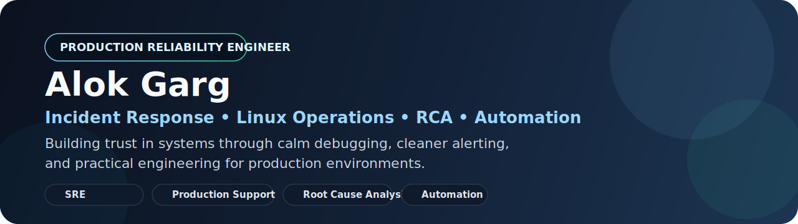

  

# Hi, I'm Alok Garg

### Site Reliability Engineer | Production Support | Incident Response | Reliability Automation

I work on production systems where uptime, fast recovery, and root-cause clarity matter.

Currently, I support mission-critical Managed File Transfer systems for Royal Mail Group at Capgemini, with hands-on experience in Linux operations, P1/P2 incident handling, alert tuning, shell automation, and cross-team service restoration.

## Current Impact

- Resolve **150+ production incidents weekly** across **10+ Linux servers**
- Lead **P1/P2 bridge calls** with structured debugging and stakeholder coordination
- Reduced **false alerts by 50%** through shell automation
- Eliminated **~40% non-actionable alerts** through RCA and monitoring cleanup

## What You'll Find Here

- Reliability-first engineering work with strong operational ownership
- IT operations and support tooling with real-world production context
- Backend and full-stack projects that show system thinking, APIs, and delivery discipline

## Featured Repositories

### [TicketInsight Pro](https://github.com/alokgarg003/ticketinsight-pro)
Open-source ticket analytics platform for IT support and operations teams.

- Incident analytics, anomaly detection, SLA tracking, alerting, and scheduled reports
- Built for teams working with ServiceNow, Jira, CSV, and REST-based ticket sources

### [CareerForge](https://github.com/alokgarg003/careerforge)
Full-stack career intelligence platform built with Next.js, TypeScript, Prisma, and analytics workflows.

- Demonstrates product design, API integration, dashboarding, and structured frontend engineering

### [Certificate Management System](https://github.com/alokgarg003/certificate)
Secure full-stack system for certificate request, approval, verification, and download workflows.

- Shows Spring Boot backend design, authentication, authorization, and React-based user flows

## Focus Areas

`site-reliability-engineering` `production-support` `incident-response` `linux` `root-cause-analysis` `alerting` `monitoring` `automation` `service-restoration` `backend-engineering`

## Tech Stack

`Linux` `Shell Scripting` `ServiceNow` `Jira` `Jenkins` `Azure` `AWS` `GoAnywhere MFT` `Bitbucket` `Confluence` `Java` `Spring Boot` `REST APIs`

## Certifications

- Azure AI Engineer Associate (AI-102)
- Azure Fundamentals (AZ-900)
- AWS Generative AI Essentials

## Open To

- Site Reliability Engineer
- Production Support Engineer
- Application Support Engineer
- Platform / Operations-focused backend roles

## Contact

- Email: `alokgarg003@gmail.com`
- LinkedIn: [linkedin.com/in/alok-garg-561a16196](https://linkedin.com/in/alok-garg-561a16196)
- Portfolio: [alok-garg-003.lovable.app](https://alok-garg-003.lovable.app/)

> Production-tested engineer focused on reliable systems, calm incident handling, and continuous operational improvement.
